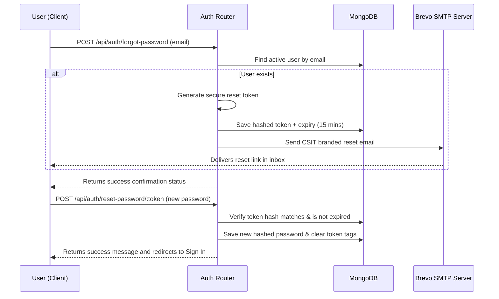

# 📚 CSIT Mentor Diary

> A Premium, Secure, and Comprehensive Teacher Guardian & Student Record System tailored for **Chhatrapati Shivaji Institute of Technology (CSIT), Durg**.

[](https://nodejs.org/)
[](https://expressjs.com/)
[](https://www.mongodb.com/)
[](LICENSE)

---

## 📖 Project Overview

**CSIT Mentor Diary** digitalizes the institutional "Teacher Guardian Scheme", offering a premium Single Page Application (SPA) designed to maintain academic continuity, tracking, and student performance observation. It replaces physical records with secure, role-based interfaces for Admins, Mentors, and Students.

---

## ✨ Key Features

*   **🔒 Secure Role-Based Gateways:** Tailored interfaces for `Admin`, `Mentor`, and `Student` with strict route authorizations.
*   **👥 Deactivated Users Management:** Instead of permanently deleting user data, admins can deactivate accounts (`isActive: false` + timestamps & reason type) with a custom Deactivated Users directory for management/reactivation.
*   **🔍 Real-Time User Search:** Premium, case-insensitive, real-time search (debounced by 300ms) on the User Management dashboard supporting Name, Email, Username, Phone, Registration Number, Department, and Role.
*   **✉️ Brevo SMTP Integration:** Transactional email system utilizing Brevo's mail relay for secure communications.
*   **🔑 Password Recovery Flow:** Cryptographically secure, time-sensitive (15-min expiry) forgot/reset password engine utilizing Nodemailer, customized HTML templates, show/hide credentials visibility, password strength indicators, and auto-redirect to login.
*   **📊 Student Diary Records:** Detailed multi-section records including Personal Info, family profiles, Academic Credentials, Prize achievements, Performance logs, and Improvement observations.
*   **📥 PDF Report Generation:** Instantly compile student record diaries into standardized PDF reports.

---

## 🛠️ Tech Stack

### Backend
*   **Runtime:** Node.js (>= 18)
*   **Web Framework:** Express.js
*   **Database ORM:** Mongoose / MongoDB Atlas
*   **Email Engine:** Nodemailer + Brevo SMTP Relay

### Frontend
*   **Architecture:** Vanilla HTML5, CSS3, & Single Page Application JS architecture
*   **Styling Theme:** Sleek dark-mode aesthetic, micro-animations, Outfit & Playfair fonts

### Security
*   **Passwords:** Bcrypt (cost factor 12)
*   **Session Management:** JWT in HTTP-Only cookies (`sameSite: strict`)
*   **Protection:** Helmet headers, CORS filters, express-rate-limit protection

---

## 📁 Project Structure

```text
csitmentor/
├── config/
│   ├── auth.js                # JWT session validation configuration
│   ├── db.js                  # MongoDB connection setup with retry logic
│   └── mail.js                # Nodemailer transporter configuration
├── middleware/
│   └── auth.js                # Authentication protection and authorization filters
├── models/
│   ├── Record.js              # StudentRecord and MentorRecord schemas
│   └── User.js                # User schema (Student/Mentor/Admin) with auditing tags
├── public/
│   ├── js/
│   │   └── app.js             # SPA Core application routing and API handlers
│   └── mentor-diary.html      # Main Single Page Application interface
├── routes/
│   ├── auth.js                # /api/auth (Login, Registration, Password Recovery)
│   ├── mentorProfile.js       # /api/mentor-profile (Mentor detailed profiles)
│   ├── records.js             # /api/records (Student records and assignments)
│   └── users.js               # /api/users (User management and search CRUD)
├── services/
│   └── email.service.js       # Email dispatch service integration
├── templates/
│   └── resetPassword.html     # CSIT-branded HTML email template
├── utils/
│   └── generateResetToken.js  # Secure cryptographically-random token generator
├── scripts/
│   └── seed.js                # Initial database seed tool for bootstrapping Admin
├── server.js                  # Entry point for the Express Server
└── .env.example               # Template environment configuration file
```

---

## 🚀 Installation & Setup

### 1. Clone & Install Dependencies
```bash
git clone https://github.com/Priyanshu-codex/csitmentor.git
cd csitmentor
npm install
```

### 2. Configure Environment
Create a copy of `.env.example` named `.env` and fill in your MongoDB and Brevo credentials:
```bash
cp .env.example .env
```

### 3. Seed Root Admin
Create the default admin credentials (`admin@csit.edu.in`):
```bash
npm run seed
```

### 4. Run Locally
```bash
# Start development environment with nodemon hot-reload
npm run dev

# Run production server
npm start
```

---

## 📝 Environment Variables (`.env.example`)

```env
# MongoDB Connection
MONGO_URI=mongodb+srv://<user>:<password>@cluster.mongodb.net/csit_mentor_diary

# JWT Secrets
JWT_SECRET=your_jwt_secret_hash_here
JWT_EXPIRES_IN=24h

# Authorization Keys for Signup
ADMIN_REGISTRATION_KEY=Admin@csit
MENTOR_REGISTRATION_KEY=Mentor@csit

# Server Port
PORT=5000
NODE_ENV=development

# Allowed CORS Origins
ALLOWED_ORIGINS=http://localhost:3000,http://127.0.0.1:5500,http://localhost:5000

# Brevo SMTP Configuration
BREVO_HOST=smtp-relay.brevo.com
BREVO_PORT=587
BREVO_USER=your_brevo_username
BREVO_PASS=your_brevo_smtp_key
MAIL_FROM=priyanshumahobia22@gmail.com
CLIENT_URL=https://csitmentor.onrender.com
```

---

## 🏷️ User Roles & Section Access

| Role | Description | Access Rights |
| :--- | :--- | :--- |
| **Student** | Learner / Mentee | View-only access to academic parameters; editable personal, family, and activity logs. |
| **Mentor** | Educator / Teacher Guardian | Edit access to assessment charts, evaluations, and observations; view assigned students. |
| **Admin** | Department Manager | Read/Write access to all records, user accounts management, deactivated lists, and mentors assignment. |

### Record Sections Write Permissions

| Section | Student | Mentor | Admin |
| :--- | :---: | :---: | :---: |
| Personal, Family, Credentials, Prizes, Participation | ✓ | ✓ | ✓ |
| Performance Charts, Improvement logs, Mentor Interactions | — | ✓ | ✓ |

---

## 🔒 Authentication & Security

1.  **JWT Protection:** Handled via httpOnly cookies protecting against XSS attacks.
2.  **Rate Limiter:** Prevent brute-force attempts with a limit of 10 login requests per 15 minutes per IP.
3.  **Encrypted Storage:** Passwords hashed with bcryptjs salt-factor 12.
4.  **CORS & Helmet:** Blocks malicious cross-site scripting and unauthorized resource queries.

---

## 📧 Password Recovery Flow



---

## 🖼️ Screenshots

> Placeholder for user dashboard screenshots:

*   *Welcome Gateway (Authentication Overlay)*
*   *Teacher Guardian Dashboard*
*   *Academic Performance Matrix*

---

## 🌐 Deployment Guide

### Option A: Render Deployment (Easiest)
1.  Connect your GitHub repository to **Render**.
2.  Select **Web Service** as the deployment format.
3.  In the environment settings, add the keys listed in the `.env.example` section.
4.  Specify the build and start commands:
    *   Build Command: `npm install`
    *   Start Command: `node server.js`

### Option B: VPS Deployment (Nginx + PM2)
```bash
# Install PM2 globally
npm install -g pm2

# Run service using PM2 manager
pm2 start server.js --name csit-diary
pm2 save
pm2 startup
```

Set up an Nginx reverse proxy routing port `80` requests to `http://localhost:5000`.

---

## 🔮 Future Enhancements

*   **📈 Advanced Analytics:** Graphical representation of historical student data.
*   **💬 Internal Messaging:** Instant messaging channel between mentors and students.
*   **🔔 Push Notifications:** Instant alert flags for academic deadlines and pending review tasks.

---

## 🤝 Contributing

Contributions are welcome! Please fork the repository, make your modifications inside a feature branch, and submit a pull request.

---

## 📄 License

This project is licensed under the MIT License. See the [LICENSE](LICENSE) file for more information.

---

## 👨‍💻 Developer Information

*   **Developer Name:** Priyanshu Mahobia
*   **Institution:** Chhatrapati Shivaji Institute of Technology (CSIT), Durg
*   **Email:** [priyanshumahobia22@gmail.com](mailto:priyanshumahobia22@gmail.com)
*   **GitHub:** [@Priyanshu-codex](https://github.com/Priyanshu-codex)
